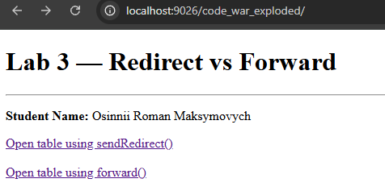
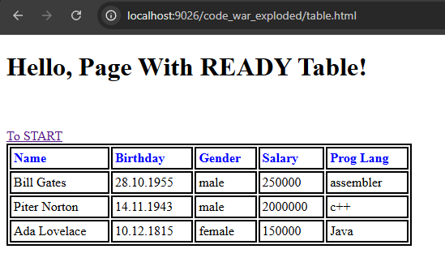
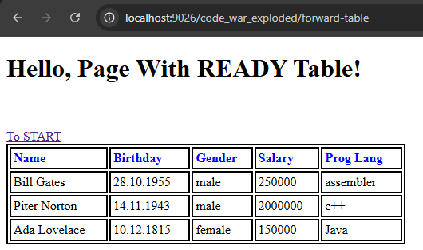

# Laboratory Work #3
## Calling a Static Web Page Using `sendRedirect()` and `forward()`

**Student:** Osinnii Roman Maksymovych  
**Group:** KN223L  
**Specialty:** 121 Software Engineering  
**University:** National Technical University "Kharkiv Polytechnic Institute"

---

## Objective

Implement a web project that demonstrates two different ways of navigating from a servlet to an existing static page (`table.html`):

- `HttpServletResponse.sendRedirect()`
- `RequestDispatcher.forward()`

The start page must contain **two controls** (links/buttons/forms) to launch each servlet.

---

## Requirements

- JDK 17
- Apache Tomcat 10.1 (HTTP port: **9026**)
- Jakarta Servlet API 6.0
- IntelliJ IDEA (Jakarta EE / Maven project)

Base URL (as used in this course):

```text
http://localhost:9026/code_war_exploded/
```

---

## Project Structure

| Component | Description |
|---|---|
| `index.jsp` | Start page with links to both servlets |
| `table.html` | Static HTML page (provided template) with styled table |
| `RedirectToTableServlet` | Calls `table.html` via `sendRedirect()` |
| `ForwardToTableServlet` | Calls `table.html` via `forward()` |

> `table.html` must be placed in: `src/main/webapp/table.html`

---

## Start Page (`index.jsp`)

Example start page with two controls (HTTP GET links):

```jsp
<%@ page contentType="text/html; charset=UTF-8" pageEncoding="UTF-8" %>
<!DOCTYPE html>
<html>
<head>
  <title>Lab 3 - Redirect vs Forward</title>
</head>
<body>
  <h1>Lab 3: Redirect vs Forward</h1>
  <p>Osinnii Roman Maksymovych, KN223L</p>

  <hr>

  <a href="redirect-table">Open table.html using sendRedirect()</a>
  <br><br>
  <a href="forward-table">Open table.html using forward()</a>
</body>
</html>
```

---

## Servlet 1 — `sendRedirect()`

### Mapping
```java
@WebServlet("/redirect-table")
```

### Implementation
```java
import jakarta.servlet.annotation.WebServlet;
import jakarta.servlet.http.HttpServlet;
import jakarta.servlet.http.HttpServletRequest;
import jakarta.servlet.http.HttpServletResponse;

import java.io.IOException;

/**
 * Servlet that redirect user to table.html.
 * @author Osinnii Roman
 * @group KN223L
 * @version 1.0
 * @since 2026-02-18
 */
@WebServlet("/redirect-table")
public class RedirectToTableServlet extends HttpServlet {

    @Override
    protected void doGet(HttpServletRequest request, HttpServletResponse response) throws IOException {

        String path = request.getContextPath() + "/table.html";
        response.sendRedirect(path);
    }
}
```

---

## Servlet 2 — `forward()`

### Mapping
```java
@WebServlet("/forward-table")
```

### Implementation
```java
import jakarta.servlet.RequestDispatcher;
import jakarta.servlet.ServletContext;
import jakarta.servlet.ServletException;
import jakarta.servlet.annotation.WebServlet;
import jakarta.servlet.http.HttpServlet;
import jakarta.servlet.http.HttpServletRequest;
import jakarta.servlet.http.HttpServletResponse;

import java.io.IOException;

/**
 * Servlet that forward user to table.html.
 * @author Osinnii Roman
 * @group KN223L
 * @version 1.0
 * @since 2026-02-18
 */

@WebServlet("/forward-table")
public class ForwardToTableServlet extends HttpServlet {

    @Override
    protected void doGet(HttpServletRequest request, HttpServletResponse response)
            throws ServletException, IOException {

        String path = "/table.html";
        ServletContext servletContext = getServletContext();
        RequestDispatcher requestDispatcher = servletContext.getRequestDispatcher(path);
        requestDispatcher.forward(request, response);
    }
}
```

---

## How to Run

1. Add `table.html` to `src/main/webapp/`.
2. Add the two servlets to `src/main/java/...`.
3. Update `index.jsp` to include two links/buttons.
4. Run Tomcat configuration in IntelliJ IDEA.
5. Open:

```text
http://localhost:9026/code_war_exploded/
```

---

## Observations (Address Bar Behavior)

### 1) `sendRedirect()`
- The browser performs a **new request** to `table.html`.
- The **address bar changes** to the URL of `table.html`.

Expected: the address bar displays something like:

```text
.../table.html
```

### 2) `forward()`
- The server internally forwards the request to `table.html`.
- The **address bar does NOT change** (it stays on the servlet URL).

Expected: the address bar stays like:

```text
.../forward-table
```

---

## Screenshots (Report)

Insert screenshots here:

- Start page with two controls *(index.jsp)*
- Result page after `sendRedirect()` and the address bar
- Result page after `forward()` and the address bar

Example:

### Start Page


### sendRedirect()


### forward()


---

## Conclusion

This laboratory work demonstrates the difference between:

- **Client-side redirect** (`sendRedirect()`): creates a new request and changes the browser URL.
- **Server-side forward** (`forward()`): internal server dispatching without changing the browser URL.

