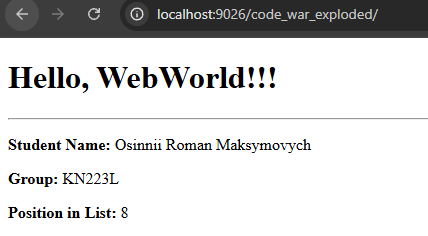
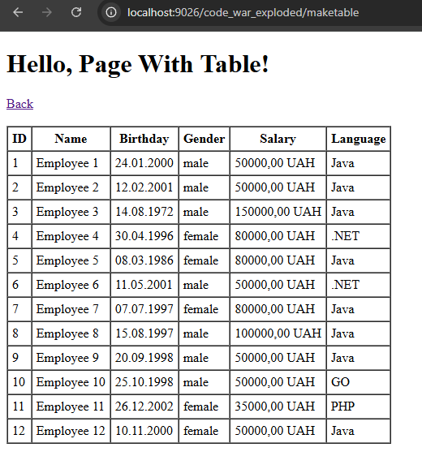

# Laboratory Work #2
## Displaying a List of IT Company Employees Using a Servlet

**Student:** Osinnii Roman Maksymovych  
**Group:** KN223L  
**Specialty:** 121 Software Engineering  
**University:** National Technical University "Kharkiv Polytechnic Institute"

---

## Objective

Develop a Java web application that displays a list of employees of an IT company on a web page:
- the start page (`index.jsp`) launches a servlet via an HTTP GET request;
- the servlet dynamically generates an HTML page;
- the page contains an HTML table built from a collection of employee objects.

---

## Application Workflow

1. Open the start page in the browser.
2. Click the link to the servlet (`/maketable`).
3. The servlet generates an HTML page with a table of employees.
4. The page contains a **Back** link to return to the start page.

---

## Project Structure

| Component | Description |
|---|---|
| `index.jsp` | Start page with a link that runs the servlet |
| `MakeTableServlet` | Servlet that generates an HTML page and employee table |
| `Employee` | Employee model class *(provided by instructor)* |
| `EmployeeList` | Collection of employees *(provided by instructor)* |
| `ProgramLanguages` | Enum of programming languages *(provided by instructor)* |

---

## Academic Integrity Note

The following classes were provided by the instructor and are **not** authored by the student:

- `Employee`
- `EmployeeList`
- `ProgramLanguages`

The student implemented:
- `index.jsp` start page (UI link to servlet)
- `MakeTableServlet` (HTML generation and table rendering)
- deployment/run configuration in the IDE

---

## Start Page (`index.jsp`)

```jsp
<%@ page contentType="text/html; charset=UTF-8" pageEncoding="UTF-8" %>
<!DOCTYPE html>
<html>
<head>
    <title>JSP - Hello World</title>
</head>
<body>
<h1>Hello, Page With Table!</h1>
<br/>
<h2>Osinnii Roman Maksymovich</h2>
<h3>Task 2</h3>
<br>
<a href="maketable">Show my list with table!</a>
</body>
</html>
```

---

## Servlet Mapping

The servlet is mapped using annotation:

```java
@WebServlet("/maketable")
```

---

## How to Run

### Requirements
- JDK 17
- Apache Tomcat 10.1
- IntelliJ IDEA (Jakarta EE project)
- Tomcat HTTP port: **9026**

### Run Steps
1. Start Tomcat from IntelliJ IDEA (Run configuration).
2. Open the application:

```text
http://localhost:9026/code_war_exploded/
```

3. Click **“Show my list with table!”** to open the servlet page.

---

## Result

After run:
- the servlet returns a dynamically generated HTML page;
- an employees table is displayed;
- the **Back** link returns to the start page.

---

## Screenshots

### Start Page


### Employees Table

---

## Conclusion

This laboratory work demonstrates:
- launching a servlet from a JSP start page using HTTP GET;
- generating HTML in a servlet using `PrintWriter`;
- building an HTML table from a Java collection;
- deploying and running a Jakarta Servlet application on Apache Tomcat 10.1.
